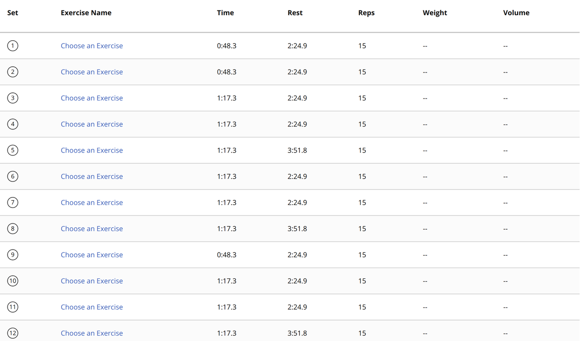
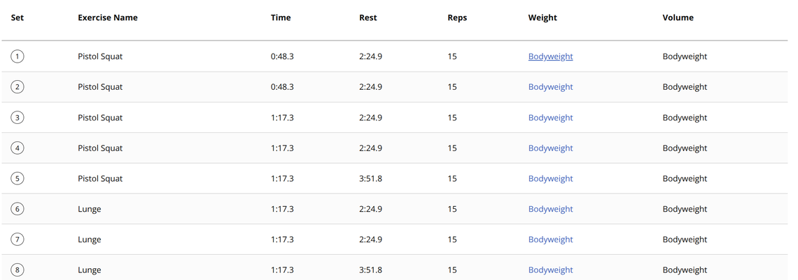
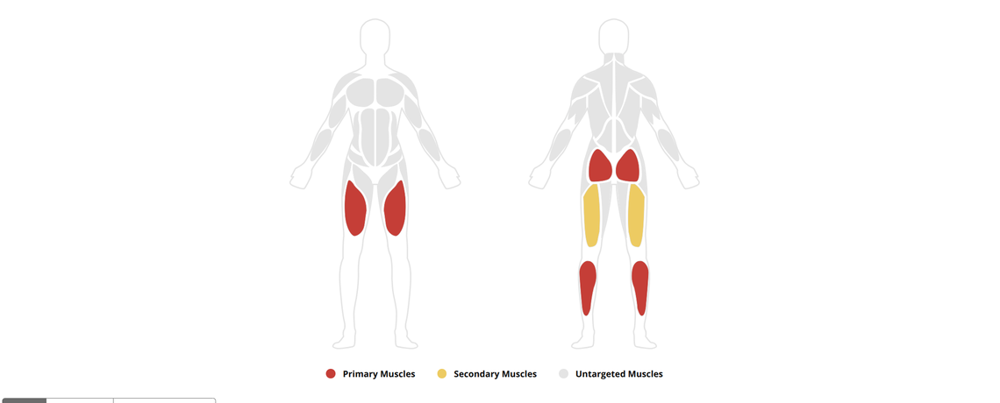
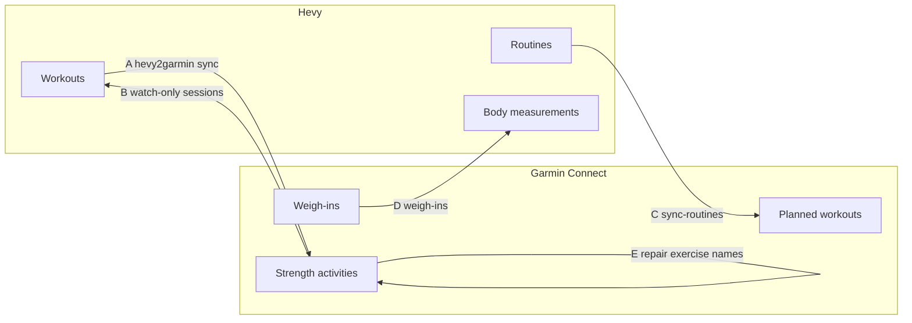

# garmin-hevy-sync

Two-way sync between a Garmin watch and [Hevy](https://www.hevyapp.com/),
running unattended on a systemd timer.

Garmin and Hevy have no official integration. Hevy has said Garmin rejected its
API request, so everything here rides on Hevy's public API plus a community
reverse-engineering of Garmin Connect.

The usual pattern it solves: you start a Strength activity on the watch so you
get real heart rate and training load, but you log the actual sets in Hevy on
your phone because typing reps on a watch is miserable. Without a sync you end
up with half the session in each app.

## The exercise-name fix

Merging Hevy sets into a watch-recorded activity leaves every set showing as
"Choose an Exercise", even though Garmin has stored a correct exercise name for
each one. This repo works out why and repairs it automatically.

Before:



After:



The muscle map, which stays blank while the names are unresolved, comes back
too:



[How it works](#flow-e-making-the-exercise-names-render) is written up below,
because the cause is not obvious and the same trap affects anyone pushing sets
into Garmin programmatically.

## What it does

Five flows, run in order every 30 minutes:

| Flow | Direction | Implementation |
|------|-----------|----------------|
| A | Hevy workouts to Garmin activities | [`hevy2garmin`](https://github.com/drkostas/hevy2garmin) `sync` |
| C | Hevy routines to Garmin planned workouts | `hevy2garmin sync-routines` |
| B | Garmin watch strength sessions to Hevy workouts | this repo (`gh_sync`) |
| D | Garmin weigh-ins to Hevy body measurements | this repo (`gh_sync`) |
| E | Makes flow A's pushed exercise names render | this repo (`gh_sync`) |



Flow A is the one that matters for the common case. It finds the
watch-recorded activity and merges the Hevy sets, reps and weights into it, so
Garmin keeps real heart rate and calories instead of gaining a duplicate empty
activity.

Flow B is the fallback for sessions recorded only on the watch, with no Hevy
counterpart to merge.

## Requirements

- **Hevy Pro.** The Hevy API is subscription-gated. Without it every flow fails
  at the first request.
- **A Garmin Connect account** and a watch that records Strength activities.
  Developed against a Venu 4; anything that writes exercise sets should work.
- **Linux with systemd** for the timer. The Python itself is portable, so on
  macOS you can drive `gh-sync sync` from launchd or cron instead.
- **[uv](https://docs.astral.sh/uv/)** for the virtualenv.
- **Python 3.12.**

## Setup

```
git clone https://github.com/danieltyukov/garmin-hevy-sync.git
cd garmin-hevy-sync
./bin/bootstrap.sh
```

The first run creates `.env` from the template and stops so you can fill in
three values:

| Variable | Where to get it |
|----------|-----------------|
| `HEVY_API_KEY` | <https://hevy.com/settings?developer> (needs Hevy Pro) |
| `GARMIN_EMAIL` | Your Garmin Connect login |
| `GARMIN_PASSWORD` | Your Garmin Connect password |

Run `./bin/bootstrap.sh` again. It then installs the venv, runs the tests,
creates `config/profile.json` from the template, writes the hevy2garmin
settings, signs you in to Garmin (prompting for the 2FA code), verifies
connectivity and installs the timer. It is idempotent, so re-running after a
`git pull` is safe.

Nothing secret is committed. `.env`, `config/profile.json`, `data/` and `logs/`
are gitignored, and the Garmin token store lives in `~/.garminconnect`.

### Two-factor authentication

Keep 2FA on. `gh-sync login` prompts once for the emailed security code, and
the resulting OAuth tokens refresh themselves from then on, so it is a single
interaction rather than an ongoing tax. Disabling 2FA would weaken the account
permanently to save that one prompt.

`hevy2garmin` reads the same `~/.garminconnect` store, so one `gh-sync login`
authenticates all five flows.

The unattended path deliberately refuses to attempt a fresh login: under
systemd there is nobody to type a code, and an interactive prompt would hang
the unit until its timeout. If the token store ever expires, the sync fails
fast and tells you to run `gh-sync login` again.

Garmin rate-limits its login endpoints and answers repeated attempts with a
429. If a sign-in fails, wait a few minutes rather than retrying immediately.

## Configuration

### Credentials and tuning: `.env`

| Variable | Default | Meaning |
|----------|---------|---------|
| `HEVY_API_KEY` | | Hevy developer API key |
| `GARMIN_EMAIL` | | Garmin Connect login |
| `GARMIN_PASSWORD` | | Garmin Connect password |
| `GH_LOOKBACK_DAYS` | 14 | How far back flow B looks for watch sessions |
| `GH_BODY_LOOKBACK_DAYS` | 365 | How far back flow D looks for weigh-ins |
| `GH_OVERLAP_MINUTES` | 45 | A Garmin activity this close to a Hevy workout is treated as the same session |
| `GH_MATCH_THRESHOLD` | 0.55 | Minimum similarity to bind a Garmin exercise to a Hevy template |

The two windows are deliberately different. Workouts are frequent, so a
fortnight is plenty. Weigh-ins are sparse and irregular, and a weigh-in that
falls out of the window is never picked up again rather than merely picked up
late, so flow D gets a year.

### Body stats: `config/profile.json`

Created from `config/profile.example.json` on first bootstrap and gitignored,
because it holds your body stats. `user_profile` feeds hevy2garmin's Keytel
calorie formula, so wrong values only mean less accurate calorie estimates.

```json
{
  "user_profile": {
    "weight_kg": 70.0,
    "birth_year": 1990,
    "sex": "male",
    "vo2max": 40.0
  },
  "merge_watch_strategy": "merge"
}
```

### Sync interval

Edit `systemd/garmin-hevy-sync.timer` and re-run `bin/install-timer.sh`. The
default is every 30 minutes.

## Commands

```
gh-sync doctor              verify both credentials, list devices and recent activities
gh-sync sync                run all five flows
gh-sync sync --dry-run      report what would happen, write nothing
gh-sync sync --flows b d    run only selected flows
gh-sync status              show the ledger and the last run summary
gh-sync unmapped            Garmin exercises with no confident Hevy match
gh-sync push-to-watch       force planned workouts onto the watch now
```

Start with `gh-sync doctor`. It proves both credentials work before you debug
anything else.

## How it works

### Flow order is load-bearing

A runs before B. By the time B looks at Garmin, anything that originated in
Hevy already has a Hevy counterpart inside the overlap window and is skipped.
Running B first would import a watch session into Hevy that A was about to
enrich, producing a duplicate on both sides.

E runs last, because it reads back what A wrote and Garmin needs a moment
before a PUT is visible to a GET.

### Merge strategy

When a Hevy workout matches a session your watch recorded, hevy2garmin offers
three ways to combine them, set in `config/profile.json`:

| Strategy | Result |
|----------|--------|
| `merge` (used here) | Pushes sets, reps and weights into the watch activity and keeps every native metric: real heart rate, training effect, body battery. Exercise names need flow E to render. Nothing is deleted. |
| `replace` (upstream default) | Uploads a fresh activity with proper exercise names, then deletes the watch recording. Heart rate is carried over, but native training effect and body battery linkage are lost. |
| `describe` | Leaves the watch activity untouched and writes the exercise list into its description. No structured sets reach Garmin. |

`merge` is the default here because the reason to wear the watch while lifting
is the heart rate and training load, and `replace` throws exactly that away.

### Flow E: making the exercise names render

Under `merge`, every set arrives in Garmin Connect as "Choose an Exercise" and
the muscle map stays blank. The confusing part is that the data is fine: the
API returns a correct category and name on every set, `SQUAT` / `PISTOL_SQUAT`
rather than `UNKNOWN`. The names are stored and then ignored.

The cause is the `probability` field:

```json
{
  "exercises": [
    { "category": "SQUAT", "name": "PISTOL_SQUAT", "probability": 0.0 }
  ],
  "repetitionCount": 15,
  "setType": "ACTIVE"
}
```

Garmin's own rep detection records how confident it was that it identified a
movement. hevy2garmin writes exact names but leaves that confidence at `0.0`,
and Garmin Connect reads `0.0` as "nothing was identified", falling back to the
picker and discarding a perfectly good name in the same record.

Restating the identical sets at full confidence makes the names, the volume
column and the muscle map all appear.

Flow E does that after each sync. It rewrites only `probability`, and only on
active sets that hold a usable category at zero confidence. A named exercise
with no confidence is the signature of a programmatic push, so anything the
watch detected itself already carries a real score and is left alone, and
`UNKNOWN` categories are never given a name they do not have. Repaired
activities are recorded in `data/state.db` and not re-fetched.

This belongs upstream in hevy2garmin's merge path. Flow E is the local fix.

### Loop prevention

Bidirectional sync without guards ping-pongs forever. Four defences:

1. **Pairing check.** Flow B reads hevy2garmin's ledger
   (`~/.hevy2garmin/sync.db`, table `synced_workouts`) and skips any Garmin
   activity already paired with a Hevy workout. This is the load-bearing one:
   hevy2garmin matches within 30 minutes *but also falls back to the same
   calendar day*, so a session logged into Hevy hours after the watch recorded
   it still merges correctly. The time-based check below would miss that
   pairing and import the activity a second time.
2. **Overlap check.** Flow B skips any Garmin activity starting within
   `GH_OVERLAP_MINUTES` of an existing Hevy workout. Covers the window before
   flow A has written its ledger entry.
3. **Cross-marking.** When flow B creates a Hevy workout it immediately runs
   `hevy2garmin mark-synced <hevy_id> --garmin-id <activity_id>`, writing into
   hevy2garmin's own ledger so flow A never pushes it back.
4. **Local ledger.** `data/state.db` records every Garmin activity that flow B
   has imported or deliberately skipped. Only `failed` rows are retried.

The layering is deliberate: 1 and 2 catch different failure modes, and either
alone leaves a hole.

### Exercise mapping

Garmin names lifts as SCREAMING_SNAKE constants (`BENCH_PRESS` /
`BARBELL_BENCH_PRESS`); Hevy uses titles with equipment in parentheses
("Bench Press (Barbell)"). Neither publishes a crosswalk, so `exercise_map.py`
normalises both into token sets and scores them with Jaccard similarity plus an
equipment-agreement bonus. The bonus is what stops a barbell bench press
binding to the dumbbell template, which scores identically on tokens alone.

Results cache to `data/exercise_map.json`. To correct a bad match, move the
entry into `overrides`, which always wins:

```json
{
  "overrides": {
    "BENCH_PRESS/BARBELL_BENCH_PRESS": "the-hevy-template-uuid"
  }
}
```

Run `gh-sync unmapped` to see what scored below the threshold. Unmapped
exercises are never silently dropped: they are named in the Hevy workout
description so the gap is visible in the app.

## Operations

```
systemctl --user list-timers garmin-hevy-sync.timer
systemctl --user status garmin-hevy-sync.service
journalctl --user -u garmin-hevy-sync.service -n 100
tail -f logs/sync.log
```

The timer uses `Persistent=true`, so a run missed while the machine was off
fires on the next boot. `RandomizedDelaySec=5min` keeps your machine off the
same instant as every other scheduled job hitting Garmin.

Enable lingering if you want the timer to run without an active login session:

```
loginctl enable-linger "$USER"
```

## Troubleshooting

**Everything fails at the first request.** Run `gh-sync doctor`. A Hevy failure
usually means the API key is wrong or Hevy Pro has lapsed.

**"Garmin token store is missing or expired".** Run `gh-sync login` from a
terminal. The unattended path cannot answer a 2FA prompt by design.

**Login returns 429.** Garmin rate-limits sign-ins. Wait several minutes.
Retrying immediately extends the block.

**Exercises still show "Choose an Exercise".** Check `gh-sync status` for the
flow E count, then run `gh-sync sync --flows e`. Flow E skips activities it has
already repaired, so to force a re-check delete the row from
`exercise_names_fixed` in `data/state.db`.

**A workout synced twice.** Check the loop-prevention ledgers: `data/state.db`
here and `~/.hevy2garmin/sync.db` for flow A's pairings.

**Sync summary shows all zeros.** That is normal in a steady state. Every flow
reports a `considered` or `checked` count so "nothing needed doing" stays
distinguishable from "nothing was found".

## Limitations

- Hevy Pro is required. The API is subscription-gated.
- Garmin has no public consumer API. `garth` tracks the mobile SSO flow, and a
  Garmin-side change can break login until the library is updated. This is an
  unofficial integration; it can break without warning.
- Flow B cannot recover heart rate into Hevy: the Hevy API accepts sets, reps,
  weight, distance and duration, but has no field for heart rate.
- Supersets recorded on the watch import as separate consecutive exercises
  rather than a linked Hevy superset. Order is preserved.
- Deleting a workout on one side does not delete its counterpart.
- Flow D is one-way. Garmin weigh-ins reach Hevy, but a weight logged only in
  Hevy stays there, so Garmin is not a complete record of body weight.
- Sync latency is bounded by the timer and by the machine being awake. A
  session appears within 30 minutes of finishing, not instantly.
- Some watches auto-detect the movement but record `repetitionCount` as 0 with
  no weight. Flow B keeps those sets and puts the recorded set durations in the
  exercise note, then flags the workout description with "Needs reps and weight
  filling in" rather than importing silent blanks.
- hevy2garmin logs a non-fatal `'>' not supported between instances of
  'NoneType' and 'NoneType'` while building the activity description for a
  workout whose sets have no reps or weight. The sync itself still succeeds.

## Not built: Hevy webhooks

Hevy's developer settings page offers a webhook that POSTs
`{"workoutId": "..."}` to a URL of your choosing whenever you save a workout,
expecting a 200 within 5 seconds. That would make flow A fire the moment you
rack the last set instead of within 30 minutes.

It is not wired up, because it needs a publicly reachable HTTPS endpoint: a
tunnel, a small always-on listener, and a shared secret in the authorization
header. That is a permanently exposed inbound service in exchange for shaving
at most 30 minutes off a gym session's sync. Worth revisiting if the delay ever
actually bites.

## Tests

```
.venv/bin/pytest
```

Covers tokenisation, match scoring, set grouping, unit conversion, overlap
detection, both ledgers, flow D's window and flow E's repair rules. Everything
network-facing is isolated behind `hevy.py` and `garmin_client.py`, so the
logic tests run offline with no credentials.

## License

MIT. See [LICENSE](LICENSE).

This project is not affiliated with, endorsed by, or supported by Garmin or
Hevy. Use it at your own risk.
