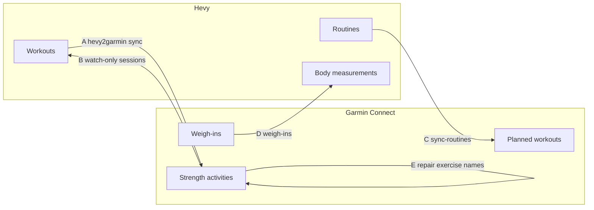

# Architecture

How garmin-hevy-sync moves data, why the flows run in the order they do, and
the reasoning behind the less obvious parts. The README covers installing and
using it; this page is for people changing it.

## Modules

| Module | Responsibility |
|--------|----------------|
| `cli.py` | Commands, and the orchestrator that runs the five flows in order |
| `config.py` | The home folder, `config.env`, settings validation, the 0.1 layout migration |
| `setup_wizard.py` | `setup`: Hevy key, Garmin sign-in, calorie profile, hevy2garmin config, schedule |
| `flows.py` | Flows B, D and E |
| `h2g.py` | Runs the hevy2garmin CLI for flows A and C, and `mark-synced` for flow B |
| `convert.py` | Pure conversion of Garmin exercise sets into a Hevy workout payload |
| `exercise_map.py` | Matching Garmin exercise identifiers to Hevy exercise templates |
| `garmin_client.py`, `hevy.py` | All network access to Garmin Connect and the Hevy API |
| `state.py` | The SQLite ledger (`state.db`) |
| `schedule.py` | systemd, cron, launchd and Task Scheduler entries |
| `lock.py` | One sync at a time |
| `notify.py` | Desktop and push notifications when an unattended run fails |

Everything network-facing sits behind `garmin_client.py`, `hevy.py` and
`h2g.py`, so the rest is tested offline against fakes.

## The five flows

| Flow | Direction | Implementation |
|------|-----------|----------------|
| A | Hevy workouts to Garmin activities | [hevy2garmin](https://github.com/drkostas/hevy2garmin) `sync` |
| C | Hevy routines to Garmin planned workouts | hevy2garmin `sync-routines` |
| B | Garmin watch strength sessions to Hevy workouts | `flows.flow_b_garmin_to_hevy` |
| D | Garmin weigh-ins to Hevy body measurements | `flows.flow_d_body_measurements` |
| E | Repair exercise names so Garmin Connect renders them | `flows.flow_e_exercise_names` |



Flow A is the one that matters for the common case. It finds the
watch-recorded activity and merges the Hevy sets, reps and weights into it, so
Garmin keeps real heart rate and calories instead of gaining a duplicate empty
activity. hevy2garmin waits `sync.grace_period_minutes` (120 by default) after
a Hevy workout ends before syncing it, so the watch recording has time to reach
Garmin and gets merged rather than duplicated.

Flow B is the fallback for sessions recorded only on the watch, with no Hevy
counterpart to merge.

Flows A and C run as child processes. hevy2garmin configures its own logging
and global state, and a crash inside it should cost one flow rather than the
whole run. The child gets the interpreter that is running garmin-hevy-sync
(`python -m hevy2garmin.cli`), so it works without any virtualenv on PATH and
stays windowless when the parent is `pythonw.exe`. It never receives the
Garmin password (see [Sign-in](#sign-in)).

### Flow order is load-bearing

A runs before B. By the time B looks at Garmin, anything that originated in
Hevy already has a Hevy counterpart inside the overlap window and is skipped.
Running B first would import a watch session into Hevy that A was about to
enrich, producing a duplicate on both sides.

E runs last, because it reads back what A wrote and Garmin needs a moment
before a PUT is visible to a GET. B and D's API work buys that time without a
bare sleep; if E still reads too early it records nothing and the next run
picks the activity up.

Each of B, D and E runs inside its own error boundary, so a failure in one is
recorded in the run summary and the others still run.

## Loop prevention

Bidirectional sync without guards ping-pongs forever. Flow B checks four
things before it imports a Garmin activity, and a fifth delay before it acts:

1. **Pairing check.** Flow B reads hevy2garmin's ledger
   (`~/.hevy2garmin/sync.db`, table `synced_workouts`) and skips any Garmin
   activity already paired with a Hevy workout. This is the load-bearing one:
   hevy2garmin matches within 30 minutes *but also falls back to the same
   calendar day*, so a session logged into Hevy hours after the watch recorded
   it still merges correctly. The time-based check below would miss that
   pairing and import the activity a second time.
2. **Overlap check.** Flow B skips any Garmin activity that started within
   `GH_OVERLAP_MINUTES` of an existing Hevy workout, or whose time range
   intersects one at all. The second test catches a Hevy workout started well
   into a session the watch was already recording. Covers the window before
   flow A has written its ledger entry.
3. **Cross-marking.** When flow B creates a Hevy workout it immediately runs
   `hevy2garmin mark-synced <hevy_id> --garmin-id <activity_id>`, writing into
   hevy2garmin's own ledger so flow A never pushes it back.
4. **Local ledger.** `state.db` records every Garmin activity that flow B has
   imported or deliberately skipped. Only `failed` rows are retried.
5. **Import delay.** Flow B leaves a session alone until
   `GH_IMPORT_DELAY_MINUTES` (180) after it ended. The watch usually reaches
   Garmin before the workout has been saved in Hevy; importing straight away
   would race that save and create a duplicate in Hevy. The delay also has to
   outlast hevy2garmin's grace period (120 minutes) plus one sync interval,
   because flow A only writes the pairing that check 1 reads once that grace
   period is over. A deferred session is not recorded, so the next run simply
   looks again.

The layering is deliberate: each check catches a failure mode the others
leave open.

Two process-level guards back these up. The ledger runs in autocommit mode, so
a row describing a workout that already exists in Hevy is on disk before the
next request is made; a crash later in the run cannot make the tool forget it.
And `lock.py` holds an OS file lock for the duration of a sync, so a manual run
and a scheduled run cannot both pass the ledger check for the same activity.

Writes to Hevy are not retried blindly. A POST is sent again only when Hevy
provably did not process it (the connection was never made, or it answered
429). After a read timeout or a 5xx the workout may already exist, so the
activity is recorded as failed instead, and on the next run the overlap check
finds the workout if it was created after all.

## Flow E: making the exercise names render

Under hevy2garmin's `merge` strategy before version 0.12, every set arrived in
Garmin Connect as "Choose an Exercise" and the muscle map stayed blank. The
confusing part is that the data was fine: the API returns a correct category
and name on every set, `SQUAT` / `PISTOL_SQUAT` rather than `UNKNOWN`. The
names were stored and then ignored.

The cause is the `probability` field:

```json
{
  "exercises": [
    { "category": "SQUAT", "name": "PISTOL_SQUAT", "probability": 0.0 }
  ],
  "repetitionCount": 15,
  "setType": "ACTIVE"
}
```

Garmin's own rep detection records how confident it was that it identified a
movement. The merge wrote exact names but left that confidence at `0.0` (or
null), and Garmin Connect reads that as "nothing was identified", falling back
to the picker and discarding a perfectly good name in the same record.
Restating the identical sets at full confidence makes the names, the volume
column and the muscle map all appear.

hevy2garmin 0.12 now writes `probability: 100` itself. Flow E stays as the
repair for activities merged by older versions and for anything else that
pushes named sets at zero confidence. It rewrites only `probability`, and only
on active sets that hold a usable category at zero confidence. A named exercise
with no confidence is the signature of a programmatic push, so anything the
watch detected itself already carries a real score and is left alone, and
`UNKNOWN` categories are never given a name they do not have. Repaired
activities are recorded in `state.db` and not fetched again.

## Exercise mapping

Garmin names lifts as SCREAMING_SNAKE constants (`BENCH_PRESS` /
`BARBELL_BENCH_PRESS`); Hevy uses titles with equipment in parentheses
("Bench Press (Barbell)"). Neither publishes a crosswalk, so `exercise_map.py`
normalises both into token sets and scores them.

Plain Jaccard similarity treats every unmatched token alike, which is wrong
here: given Garmin's `FRONT_RAISE`, "Front Raise (Dumbbell)" and "Front Lever
Raise" score the same, but only the first is the same exercise. The scorer
therefore charges a quarter of a token for extra equipment words (Garmin often
omits equipment that Hevy names) and three quarters for extra movement words,
and takes a flat penalty for an outright equipment contradiction. Equipment
named anywhere in the Garmin pair is a hard filter, and ties break on what the
unqualified name conventionally means in a gym (barbell, then dumbbell, then
bodyweight, and so on) rather than on title length.

Results are cached in `exercise_map.json` in the home folder. To correct a bad
match, add an entry under `overrides`, which always wins:

```json
{
  "overrides": {
    "BENCH_PRESS/BARBELL_BENCH_PRESS": "the-hevy-template-uuid"
  }
}
```

`garmin-hevy-sync unmapped` lists what scored below `GH_MATCH_THRESHOLD`.
Unmapped exercises are never silently dropped: they are named in the Hevy
workout description so the gap is visible in the app. Sets where the watch
recorded no reps or weight keep their durations in the exercise note, and the
description says "Needs reps and weight filling in".

Supersets recorded on the watch import as consecutive exercises in recorded
order rather than a linked Hevy superset.

## Sign-in

Garmin has no public consumer API. garminconnect signs in through the same SSO
flow as the mobile app and caches OAuth tokens in `~/.garminconnect` (or
`GARMINTOKENS`), which hevy2garmin shares. The tokens refresh themselves.

The password is used once, by `login` or `setup`, and never stored. Every
unattended path builds the Garmin client without credentials. Given a
password, garminconnect falls back to a full sign-in whenever the token store
is missing or rejected; under a scheduler nobody can answer the emailed MFA
code, and repeating the attempt every 30 minutes earns a 429 from Garmin's SSO
that then blocks the manual sign-in as well. Failing fast with "run
`garmin-hevy-sync login`" is the better outcome. For the same reason the
hevy2garmin child process never receives `GARMIN_PASSWORD`, and `setup`
removes a `garmin_password` that older setups left in
`~/.hevy2garmin/config.json`.

A failure to reach Garmin while a token store exists is reported as Garmin
being unavailable, not as a sign-in problem, so nobody is sent to log in again
because their Wi-Fi dropped.

## Background scheduling

| Platform | Backend | Catch-up after sleep or power off |
|----------|---------|-----------------------------------|
| Linux | systemd user timer, `OnCalendar=*:0/30`, `Persistent=true`, lingering enabled where allowed | yes |
| Linux without a systemd user session | crontab line tagged `# garmin-hevy-sync` | no |
| macOS | launchd agent `io.github.danieltyukov.garmin-hevy-sync`, `StartInterval` | yes (runs on wake) |
| Windows | Task Scheduler task `garmin-hevy-sync`, `StartWhenAvailable`, run through `pythonw.exe` | yes |
| Docker | the container's own `sync --every 30m` loop | n/a |

Each entry runs `<interpreter> -m gh_sync --home <home folder> sync`. The home
folder is always spelled out, because schedulers start with a minimal
environment and would otherwise work out a different default (for example
without the `XDG_CONFIG_HOME` of the shell that ran setup). Storing the interpreter of the tool's own environment
rather than a console script keeps the entry valid across reinstalls and lets
Windows use the windowless `pythonw.exe`. Intervals must divide an hour or a
day evenly, because systemd calendar expressions and cron both count from the
top of the hour.

The 0.1 timer used `OnUnitActiveSec=` together with `Persistent=true`, but
`Persistent=` only applies to `OnCalendar=` timers, so missed runs were never
caught up. 0.2 switched to a calendar timer.

## Notifications

When a run started by a scheduler (stdin is not a terminal) fails, including
one that cannot start at all because the configuration is broken, `notify.py`
raises a desktop notification (`notify-send`, `osascript`, or a Windows toast
through PowerShell) and, if `GH_NOTIFY_URL` is set, POSTs the message as plain
text with `Title` and `Tags` headers, the format ntfy.sh accepts. The ledger's
`meta` table rate-limits this to one notification when a problem starts and
then at most one a day while it persists; a clean run resets it.

## Not built: Hevy webhooks

Hevy's developer settings offer a webhook that POSTs `{"workoutId": "..."}` to a
URL of your choosing whenever you save a workout, expecting a 200 within 5
seconds. That would make flow A fire the moment you rack the last set instead
of within 30 minutes.

It is not wired up, because it needs a publicly reachable HTTPS endpoint: a
tunnel, an always-on listener, and a shared secret in the authorization header.
That is a permanently exposed inbound service in exchange for shaving at most
30 minutes off a sync, and hevy2garmin's grace period delays flow A by two
hours anyway so the watch recording can be merged. Worth revisiting if the
delay ever matters.

## Upstream dependency

hevy2garmin's PyPI package (the CLI used for flows A and C) is deprecated and
receives no releases after 2026-10-31; its npm package and web dashboard
replace it. The dependency is pinned below 0.13, and the published versions
keep working, but a breaking change on Garmin's side would have to be fixed
here rather than upstream. Replacing flows A and C with an in-repo
implementation, or with the npm CLI, is the open question for a future
version.
